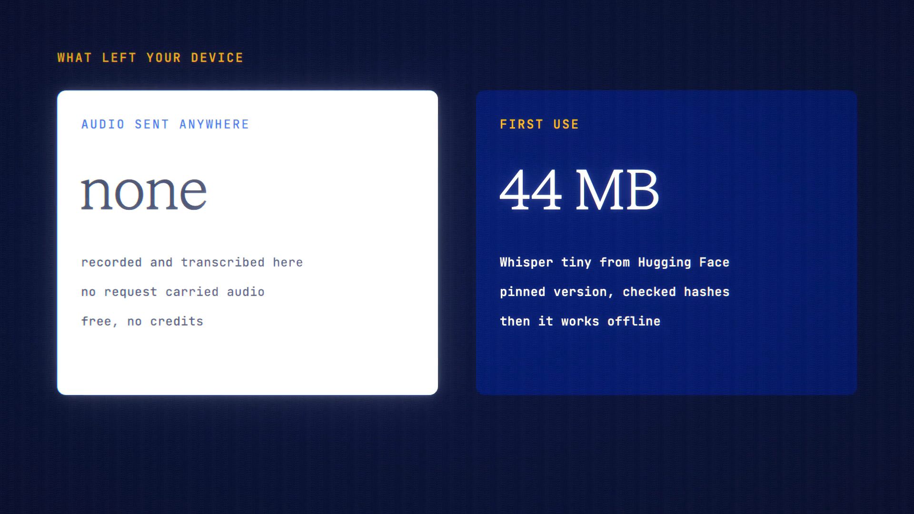

# Private Dictation is live

**Hosted feature release · September 2026**

Talk instead of typing, for free.

Private Dictation adds "On this device (free)" to the composer's microphone
menu, beside paid transcription.

- Whisper runs in your browser, so the recording never leaves your device and
  costs nothing. Choose the tiny or base model.
- The first use downloads the model from Hugging Face (tiny is about 44–55 MB
  and base about 80–85 MB, depending on your device), at a pinned version
  checked against pinned file hashes, plus a 27 MB speech engine from ANONYMA.
  After that it works offline, and you can remove the download.
- The text lands in the composer for you to review. Nothing goes to a model
  until you press Send. (Like typed text, the draft is used for the live cost
  estimate.)
- It works everywhere, including Private Mode and off the record.

It's less accurate than the paid transcription models.

[Download the 23-second launch film](../assets/releases/private-dictation.mp4)

## Video validation

A 23-second launch film recorded on the release build now in production, on a
local demo server with a simulated microphone, using Whisper tiny on the
device's processor (a 44 MB download).

- From recording to the text landing, no request carried audio. The only outside
  downloads were the pinned model files from Hugging Face.
- The words appeared in the composer and weren't sent. The composer's cost
  estimate is cropped out of the film.

1920×1080, 30 fps, H.264, no audio, metadata removed.

Docs and original artwork: CC BY-NC 4.0. Code: PolyForm Noncommercial 1.0.0.
See [LICENSE](../../LICENSE) and [NOTICE](../../NOTICE).
