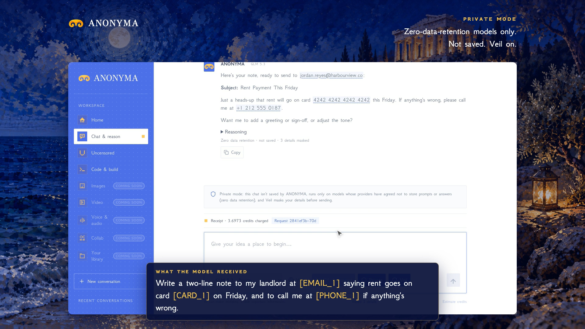

# Private Mode and Ephemeral Chats are live

**Hosted feature release · September 25, 2026**

One switch. Nothing saved.

[Open Anonyma chat](https://askanonyma.com/workspace/chat) and turn on
**Private** in the composer. Three things happen at once:

- The model picker narrows to models whose providers have agreed not to store
  prompts or answers (zero data retention). In Chat that is GLM 5.3 and
  DeepSeek V4.1 Flash; in [Uncensored](uncensored-models.md) all five models
  qualify.
- **Off the record** turns on, so ANONYMA doesn't save the conversation. Leave
  or reload, and it's gone.
- **Veil** masks email addresses, card numbers, phone numbers and keys in your
  browser before the prompt is sent.

Every private reply carries a line such as "Zero data retention · not saved ·
3 details masked", and you still get a receipt for what it cost.

Ephemeral Chats ships alongside it. Turn on **Off the record** on its own for
any chat, or set a saved chat to delete itself after 1, 7 or 30 days.

[Download the 37-second launch film](../assets/releases/private-mode.mp4)

## How it works

The model gateway labels each model's privacy level. Private Mode offers only
models labelled zero data retention, and it asks the gateway to route each
request only to providers that keep no data and don't collect it. Private
requests never fall back to the backup gateway.

## Activation

The Ephemeral Chats and Private Mode entries in `server/releases.js` now have
`released: true`. Private Mode depends on Ephemeral Chats, so they were
released together. The other feature releases keep their gates.

## Limitations

Zero data retention is a commitment from the gateway and the model providers.
ANONYMA can't verify it cryptographically; end-to-end encrypted models are a
later update. The model provider still processes the text you send, which is
why Veil masks details first. Veil catches common patterns, not everything.

## Run locally

Follow the [local setup](../../README.md#run-locally) and set
`RELEASED_FEATURES=mvp`. Private Mode needs the gateway's synced catalog for
its privacy labels; local test mode can list models in `PRIVATE_MODELS`
instead.

## Video validation

The launch film is 1920×1080, 30 fps, H.264, without audio. It is a screen
recording of the released feature against the real gateway, with a real
GLM 5.3 reply; the typing is shown at double speed. After the recording, the
local database held 0 conversations and 0 messages. File metadata is removed.

Docs and original artwork: CC BY-NC 4.0. Code: PolyForm Noncommercial 1.0.0.
See [LICENSE](../../LICENSE) and [NOTICE](../../NOTICE).
