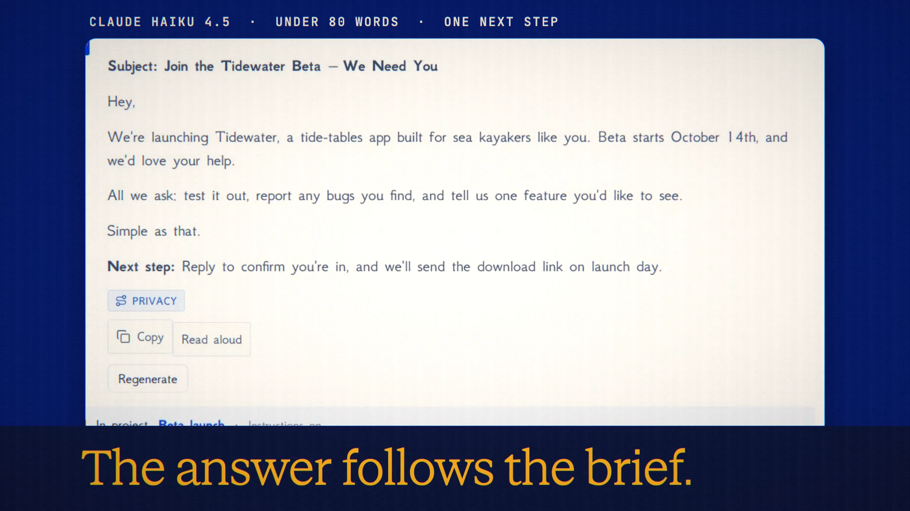

# Projects is live

**Hosted feature release · September 2026**

Keep related work together.

A project keeps related chats, files and instructions together. Each project
has:

- a name and a colour;
- instructions sent with every chat in it (Veil masks them when it's on, and
  Seed Guard checks them);
- up to 5 pinned saved files, attached to each new chat;
- a default model;
- a default way new chats start: Normal, Off the record, Device only or
  Private.

Chats and Symposium runs move in and out of projects, and History search can
filter by project. The Command Palette has "Go to project" and "New chat in
project". Off-the-record and Private project chats store nothing on the server.
Device-only project chats live in your Device Vault. An account can keep up to
50 projects. Panic Wipe, account closure and export include them.

[Download the 22-second launch film](../assets/releases/projects.mp4)

## Video validation

A 22-second launch film recorded in one take on the Projects build, on a local
demo account with a saved file, `beta-brief.txt`, made for the film. It creates
a "Beta launch" project with instructions ("Answer in under 80 words, in plain
English, and end with one next step"), Claude Haiku 4.5 as its default model
and the brief pinned. A new chat in the project sent both the instructions and
the brief. The real answer, a beta invite email, stayed under 80 words, used the
brief's details and ended with a next step. The chat is then listed in the
project. 1920×1080, 30 fps, H.264, no audio, metadata removed.

Docs and original artwork: CC BY-NC 4.0. Code: PolyForm Noncommercial 1.0.0.
See [LICENSE](../../LICENSE) and [NOTICE](../../NOTICE).
