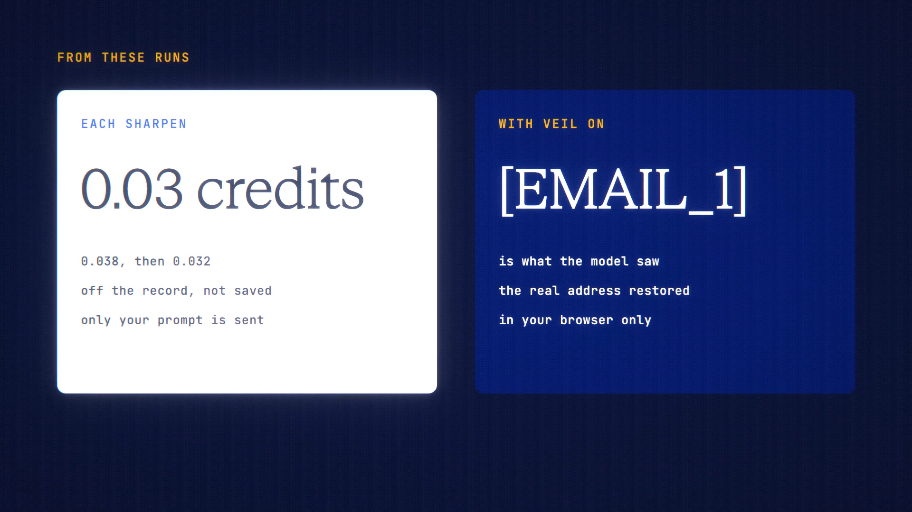

# Prompt Sharpen is live

**Hosted feature release · September 2026**

One tap turns a rough prompt into a clear one. See the changes, keep what you
like.

**Sharpen** in the composer sends your prompt to a fast, low-cost model. You see
about what it costs first. It returns an improved prompt, up to three notes on
what changed and why, and sometimes one or two questions. Answer a question to
sharpen again. **Use this** puts the new prompt in your composer, and Undo puts
the old one back.

- Always off the record: only your prompt is sent, and nothing is saved.
- With Veil on, the veiled prompt is sharpened. Placeholders must come back
  exactly or it declines, and the real details are restored in your browser.
- Project instructions aren't sent. In Private Mode, a private model is used.

[Download the 24-second launch film](../assets/releases/prompt-sharpen.mp4)

## Video validation

A 24-second launch film recorded on the Prompt Sharpen build, on a local demo
account.

- **Main take:** a rough tweet prompt was sharpened for 0.038 credits. One of
  its questions was answered and it was sharpened again for 0.032, then used.
- **Veil take:** with Veil on, the model saw [EMAIL_1], and the real address came
  back in the browser. That take cost 0.0328 credits.
- **Records:** nothing of the prompts was stored.

1920×1080, 30 fps, H.264, no audio, metadata removed.

Docs and original artwork: CC BY-NC 4.0. Code: PolyForm Noncommercial 1.0.0.
See [LICENSE](../../LICENSE) and [NOTICE](../../NOTICE).
