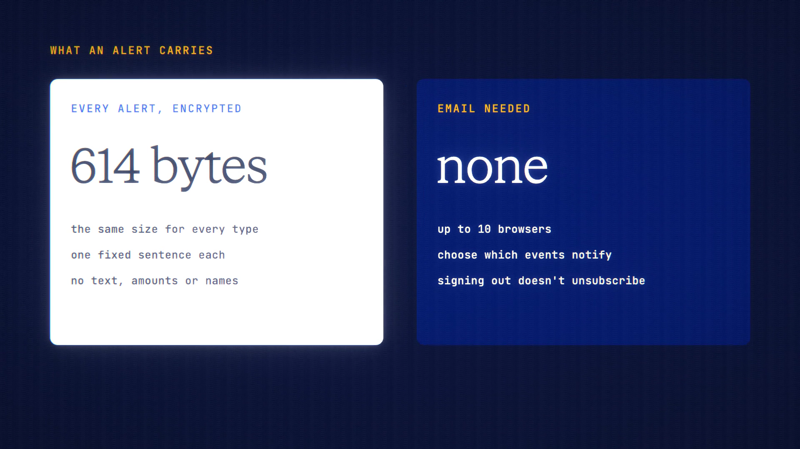

# Push Alerts is live

**Hosted feature release · September 2026**

Get alerts without giving us an email.

Push Alerts sends notifications to your browser when something happens:

- a routine result;
- a page watch change or pause;
- your balance dropping below your Low-Balance Alerts level (once per drop);
- a gift claimed or returned;
- a reminder 7 days before Inactivity Wipe would erase your history.

Turn it on in Account → Settings with "Notify me in this browser". You can
choose which events notify you, and add up to 10 browsers.

- **Content-free:** every alert is one fixed sentence, such as "Your page watch
  found a change", padded to the same size. It never includes chat text, page
  content, amounts or names.
- **Encrypted:** your browser's push service (Google, Mozilla, Apple or
  Microsoft, depending on the browser) receives only an encrypted message it
  can't read.
- Signing out doesn't unsubscribe a browser. Remove it from the list to stop
  its alerts.
- It works in any browser that supports Web Push, through the installed app's
  service worker.

[Download the 23-second launch film](../assets/releases/push-alerts.mp4)

## Video validation

A 23-second launch film recorded on the release build now in production, on a
local demo server using its own test keys.

- The browser subscribed through Google's push service, and both a test alert
  and a real low-balance alert arrived. The recording browser has no system
  notification area, so the notifications themselves aren't on screen; the
  browser's own record shows they were displayed.
- Every alert type, in every language, encrypts to exactly 614 bytes with the
  same headers, so the push service can't tell one alert from another.

1920×1080, 30 fps, H.264, no audio, metadata removed.

Docs and original artwork: CC BY-NC 4.0. Code: PolyForm Noncommercial 1.0.0.
See [LICENSE](../../LICENSE) and [NOTICE](../../NOTICE).
