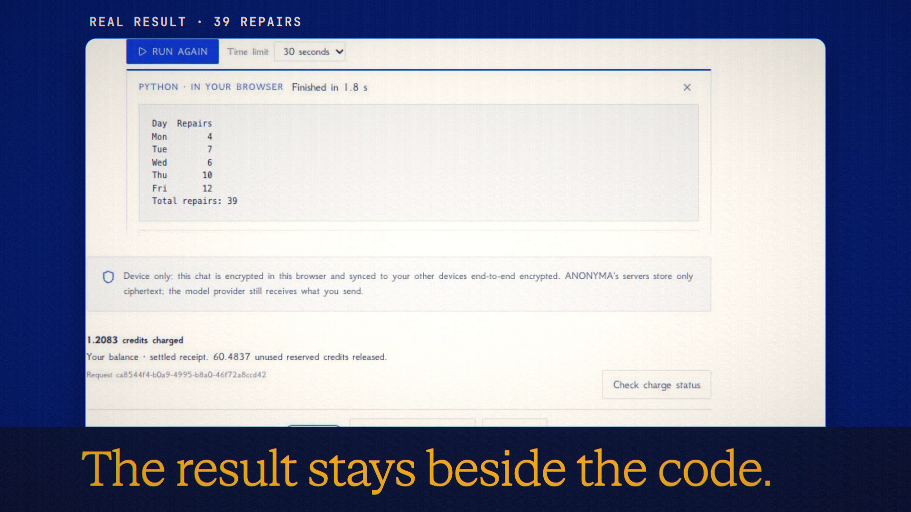

# Python Runner

**Code release · 27 September 2026 · hosted deployment pending CI**

Run generated Python beside the answer, in a browser worker.

[Public release commit](https://github.com/Anonyma-RH/Anonyma/commit/5c41b7013c06f8dcf900dfa63d336e4e074ffd91). The release code is published. The hosted rollout is pending GitHub Actions billing recovery; do not treat the local footage as proof that the hosted feature is live.

[Download the 19-second film](../assets/releases/python-runner.mp4)

## Demonstrated behavior

A real generated numpy/pandas/matplotlib script ran locally in 1.8 seconds and printed a five-day table with total repairs of 39. The film shows reviewed code, the local execution notice and actual text output.

## Limits

Code execution has no network access and can access only files you explicitly attach. Attachments for the runner are CSV. The initial runtime/package download is separate from running code. Review code first; the default time limit is 30 seconds. The figure was present in the browser DOM, but a capture rendering issue prevented a clean plot shot; the film makes no plot-demonstration claim.

## Media provenance

Edited real UI captures from a local batch 7 app, using synthetic inputs and real provider responses where applicable. Camera moves and titles are authored; the clip is not continuous realtime screen recording. No production customer data or fabricated product output. 1920×1080, 30 fps, H.264 with an original synthesized soundtrack.

Docs and original artwork: CC BY-NC 4.0. Code: PolyForm Noncommercial 1.0.0. See [LICENSE](../../LICENSE) and [NOTICE](../../NOTICE).
