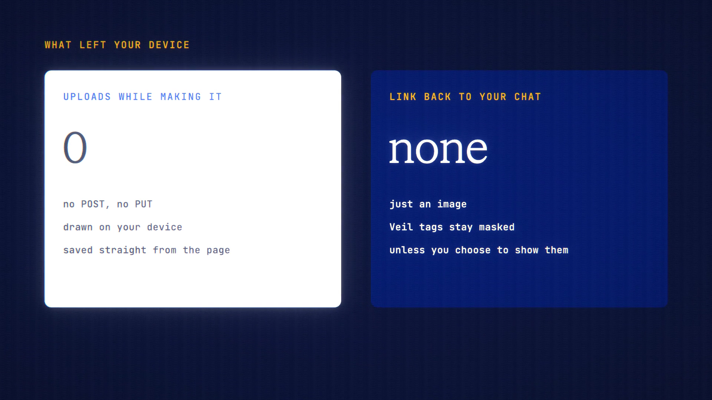

# Quote Cards is live

**Hosted feature release · September 2026**

Turn a great answer into an image to share.

Select part of a reply, or use a reply's Card action, to make an image card.

- Four house templates: Cobalt, White, Dark and Column.
- Three sizes: 1:1, 4:5 and 16:9.
- Optional lines "Asked on ANONYMA" and the model's name, each can be switched
  off.
- Save it as a PNG or copy it to the clipboard.

The card is drawn on your device. Nothing is uploaded, and there's no link back
to your chat. Details hidden by Veil stay masked on the card unless you choose
to show them.

[Download the 23-second launch film](../assets/releases/quote-cards.mp4)

## Video validation

A 23-second launch film recorded on the release build now in production, on a
local demo server, with a reply from Gemini 3.7 Flash.

- From selecting the text to saving the PNG, the page made no upload: no POST or
  PUT request. Saving is a download made inside the page.
- In a second chat, an email address masked by Veil stayed as [EMAIL_1] on the
  card by default.

1920×1080, 30 fps, H.264, no audio, metadata removed.

Docs and original artwork: CC BY-NC 4.0. Code: PolyForm Noncommercial 1.0.0.
See [LICENSE](../../LICENSE) and [NOTICE](../../NOTICE).
