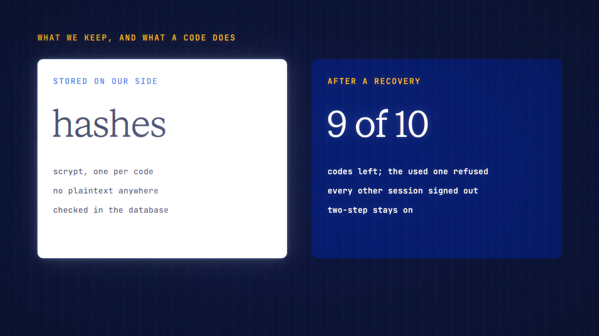

# Recovery Kit is live

**Hosted feature release · September 2026**

No email? Keep a recovery kit.

Recovery Kit gives an account ten one-time codes that get you back in if you
lose your password or passkey. Generate it in Account → Security, after
confirming it's you.

- The codes are shown once, to download or print. ANONYMA stores only their
  hashes, never the codes.
- Each code works once. Generating a new kit cancels the old one.
- To recover, choose "Use a recovery code" on the sign-in page and enter your
  username and a code. You then set a new password or add a passkey, and every
  other session is signed out.
- A code gets you in even with two-step sign-in on, so keep the kit offline and
  somewhere safe.
- API keys and connected apps keep working after a recovery.

[Download the 23-second launch film](../assets/releases/recovery-kit.mp4)

## Video validation

A 23-second launch film recorded on the release build now in production, on a
local demo test account with two-step sign-in on. The codes are masked in the
film.

- The database holds a salted scrypt hash for each code and no copy of the
  codes; a scan of the database files for all ten codes found none.
- A code got the account back in with two-step on. Every other session was
  signed out, a new password was required, and two-step stayed on.
- The same code used again was refused.

1920×1080, 30 fps, H.264, no audio, metadata removed.

Docs and original artwork: CC BY-NC 4.0. Code: PolyForm Noncommercial 1.0.0.
See [LICENSE](../../LICENSE) and [NOTICE](../../NOTICE).
