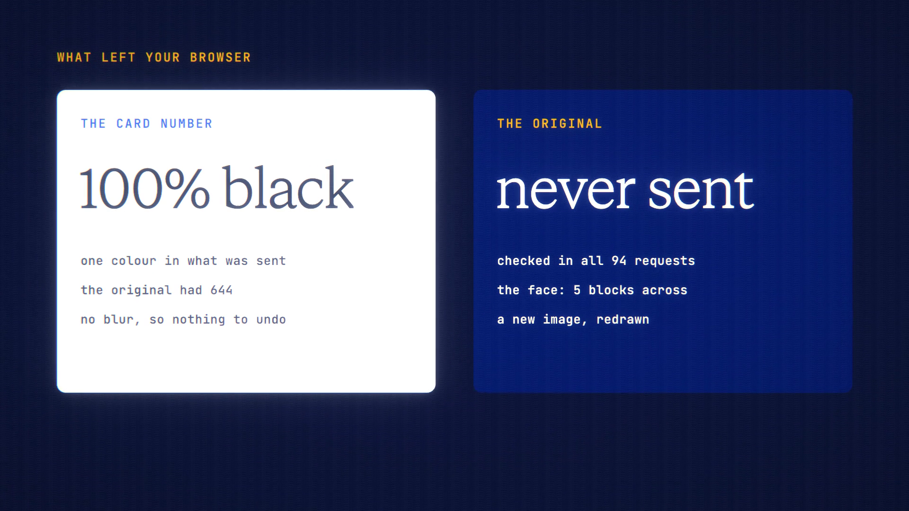

# Redact Before You Send is live

**Hosted feature release · September 2026**

Black out the parts of a screenshot you don't want to share. The original never
leaves your device.

Attach an image in chat or Image Studio and choose **Redact** on its chip. In the
editor, draw boxes:

- **Black** is for text: card numbers, names, addresses.
- **Pixelate** is for faces, with large blocks.

You can also crop, undo and zoom. **Apply** redraws the image in your browser,
so the covered pixels are destroyed and the file's metadata goes with them.
Only that redacted copy is sent, and the chip shows **Redacted**.

- There's no blur, because blur can sometimes be undone.
- There's no automatic detection: you choose what to cover.

[Download the 22-second launch film](../assets/releases/redact-before-you-send.mp4)

## Video validation

A 22-second launch film recorded on the release build, on a local demo account.
It uses a fake banking screenshot made for the film, with an invented name, a
test card number and a drawn avatar. The card number was blacked out and the
face pixelated, then the image was sent to Gemini 3.7 Flash, which answered
"(Card number is blacked out / redacted)".

The image that left the browser was checked:
- **Card number:** 100% black, one colour where the original had 644.
- **Face:** pixelated at 5 blocks across.
- **Original:** none of the 94 requests carried it.

1920×1080, 30 fps, H.264, no audio, metadata removed.

Docs and original artwork: CC BY-NC 4.0. Code: PolyForm Noncommercial 1.0.0.
See [LICENSE](../../LICENSE) and [NOTICE](../../NOTICE).
