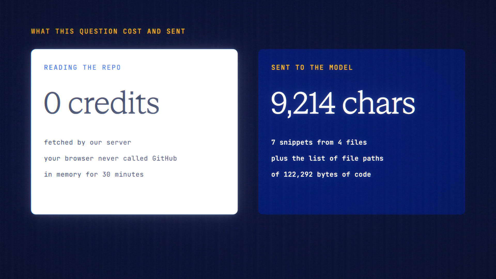

# Repo Reader is live

**Hosted feature release · September 2026**

Paste a public GitHub repo. Ask about it.

Paste the address of a public GitHub repository and ask questions about its
code.

- ANONYMA's server fetches the repository, not your browser, and keeps it in
  memory for 30 minutes: never on disk and never logged. At most 3 repositories
  are kept per account.
- Reading a repository is free, up to 20 an hour. Questions are billed as normal
  messages and are always off the record.
- The model gets the list of file paths (names only) and just the relevant
  snippets; small key files go whole. "What the AI sees" is shown before
  sending, and the answer says when relevant code wasn't sent.
- The search matches words, not meaning, so phrase questions with the words the
  code uses.
- Answers cite `path:line`, and one click opens the file at that line.
- Public GitHub repositories only. There's no GitHub sign-in and no access to
  private repositories.

[Download the 23-second launch film](../assets/releases/repo-reader.mp4)

## Video validation

A 23-second launch film recorded on the release build now in production, on a
local demo server, reading the public repository web-push-libs/web-push (33
files, 119.4 KB).

- Reading the repository cost nothing: only the answer appears in the ledger.
- The browser never contacted github.com or codeload.github.com. Every request
  went to ANONYMA's server.
- The server reported the repository would be forgotten in 30 minutes.
- The model received 7 snippets (9,214 characters) and the list of file paths,
  out of 122,292 bytes of text in the repository.
- Claude Sonnet 5.5 answered off the record for 12.99 credits, citing path:line.
  No conversation was saved.

1920×1080, 30 fps, H.264, no audio, metadata removed.

Docs and original artwork: CC BY-NC 4.0. Code: PolyForm Noncommercial 1.0.0.
See [LICENSE](../../LICENSE) and [NOTICE](../../NOTICE).
