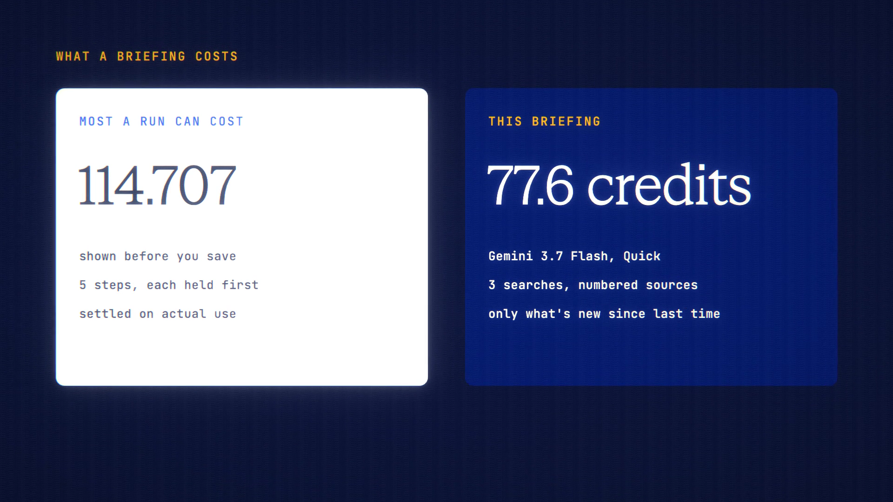

# Research Watch is live

**Hosted feature release · September 2026**

A sourced briefing on any topic, on your schedule.

Research Watch is a routine that runs Deep Research for you, daily or weekly.

- Choose a topic, Quick or Thorough depth, how often it runs, and a monthly
  budget. The most a run can cost is shown before you save.
- Each report lands in your Routines inbox with numbered sources.
- "Only what's new" compares each run with the last report, so it tells you
  what changed.
- A Push Alert tells you when a new briefing arrives, if you've turned alerts
  on.
- Each step is billed like Deep Research: held first, then settled on actual
  use. Private Mode can be set per watch.

[Download the 23-second launch film](../assets/releases/research-watch.mp4)

## Video validation

A 23-second launch film recorded on the release build now in production, on a
local demo server, with a weekly Quick watch on post-quantum encryption in
messaging apps, run with Gemini 3.7 Flash.

- The form showed "Up to 114.707 credits per run" before saving. Each run held
  its 5 steps (plan, 3 searches, report) one at a time, and those holds add up
  to exactly that figure. Every step settled on actual use; the second briefing
  cost 77.603 credits.
- A budget smaller than one run's maximum was refused at save.
- Each prompt included the current date.
- There is no "Run now" button, so for the film the demo database was set to
  make each run due.

1920×1080, 30 fps, H.264, no audio, metadata removed.

Docs and original artwork: CC BY-NC 4.0. Code: PolyForm Noncommercial 1.0.0.
See [LICENSE](../../LICENSE) and [NOTICE](../../NOTICE).
