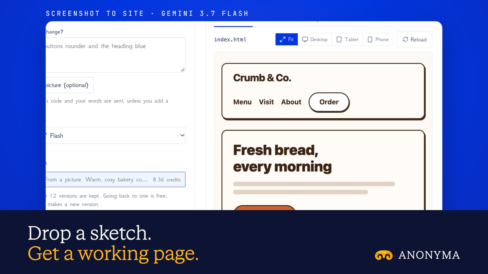

# Screenshot to Site is live

**Hosted feature release · September 2026**

Drop a screenshot or a sketch. Get a working web page.

Upload a screenshot, a sketch or a wireframe, pick a vision model, and add
notes if you like. The model returns one self-contained HTML page.

- The page is shown in Live Preview's sandbox, with network requests blocked and
  no access to your account.
- "Change it" revises the same page from your instructions, with a version list
  and undo.
- Download the `.html`, copy the code, or open it in Code & Build.
- Clean Uploads and Redact run before the picture is sent, and the picture is
  never stored.
- The price is shown first and equals the amount held. If no usable page comes
  back, nothing is charged.

## Image validation

A launch image made from the release build now in production, on a local demo
server, from a made-up bakery wireframe.

- Clean Uploads ran first, and only a redrawn copy of the picture was sent; the
  saved page holds no image.
- Gemini 3.7 Flash was quoted at up to 54.61 credits and cost 8.36 for a
  one-file page. Picture quotes run high for now, and you pay only what's used.
- The preview runs in a sandbox with network requests blocked.

2400×1350 JPEG.

Docs and original artwork: CC BY-NC 4.0. Code: PolyForm Noncommercial 1.0.0.
See [LICENSE](../../LICENSE) and [NOTICE](../../NOTICE).
