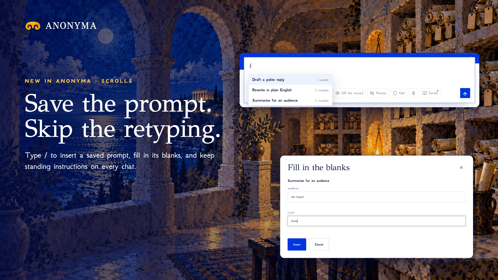

# Scrolls are live

**Hosted feature release · September 25, 2026**

Save the prompt. Skip the retyping.

Save your best prompts as Scrolls, with blanks like {{audience}} that you fill
in each time. Type **/** in Chat, Code & Build or Uncensored to insert one.

Standing instructions go with every message, whichever model you pick, and
Veil masks private details in them just like the message itself.

## Limits

Up to 200 scrolls per account. Blanks can be written in any script.

Docs and original artwork: CC BY-NC 4.0. Code: PolyForm Noncommercial 1.0.0.
See [LICENSE](../../LICENSE) and [NOTICE](../../NOTICE).
