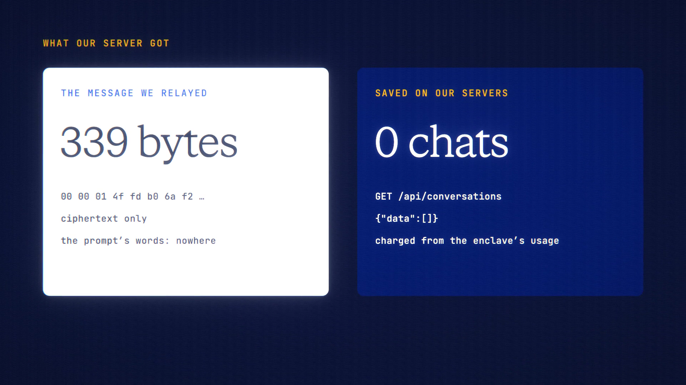

# Sealed Mode is live

**Hosted feature release · September 2026**

Your prompt, sealed.

Turn on **Sealed** in chat or code. Your browser first verifies PPQ's Tinfoil
enclave: an AMD SEV-SNP hardware attestation checked against AMD's roots, plus a
Sigstore proof of the open-source build it runs. It then encrypts your message
to that enclave with EHBP. If verification fails, nothing is sent. ANONYMA's
server relays the ciphertext untouched and never stores or logs a message body.
Billing settles from the enclave's own usage report.

- It works only on open-weight private models that run inside the enclave. By
  default that's GLM-5.3 Flash (Private via TEE).
- Sealed chats are kept only in your Device Vault when it's unlocked;
  otherwise they're kept nowhere.
- Memory, web search, saved files, saving Scrolls, Double-check, Symposium,
  voice and the live estimate are off, each with a one-line reason. The most a
  message can cost is shown instead of the estimate.
- The verification panel shows the enclave measurement, the source commit and
  release, the hardware, and when it was verified.

[Download the 20-second launch film](../assets/releases/sealed-mode.mp4)

## Honest limits

- Only open-weight private models are end-to-end encrypted.
- We still see metadata: model, time, size and tokens.
- You trust the open-source page code we serve.

## Video validation

A 20-second launch film recorded on the release build, on a local demo account.
The browser verified the live enclave: measurement `b3be62c7…dfc66c`,
`tinfoilsh/confidential-model-router` at `4b4957b` (v0.0.155), AMD SEV-SNP. It
then sent one real sealed message to GLM-5.3 Flash. The reply's note read
"Sealed · decrypted only in the enclave · not saved on our servers · 1.1745
credits charged".

Checks from that run:
- The only request that carried the message was 339 bytes of ciphertext.
- None of the prompt's words appeared in any request body the browser sent.
- The server listed no saved conversations.

1920×1080, 30 fps, H.264, no audio, metadata removed.

Docs and original artwork: CC BY-NC 4.0. Code: PolyForm Noncommercial 1.0.0.
See [LICENSE](../../LICENSE) and [NOTICE](../../NOTICE).
