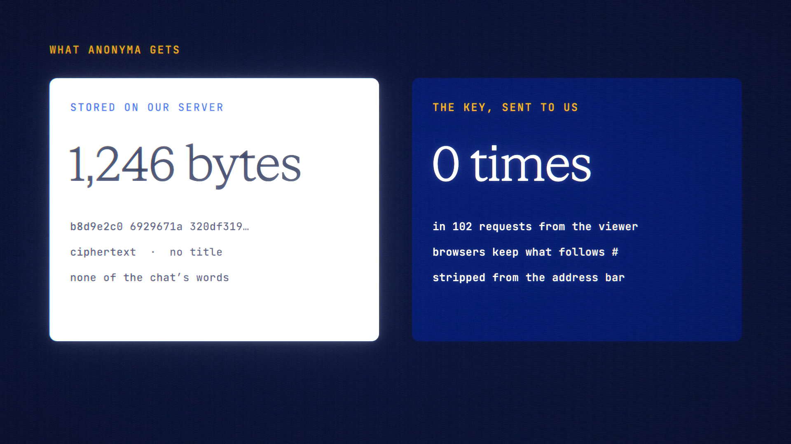

# Sealed Share is live

**Hosted feature release · September 2026**

Share a chat we can't read.

Share links are now **Sealed** by default. Your browser encrypts the chat
snapshot with a random AES-256-GCM key and uploads only the ciphertext. The link
looks like `/s/<token>#k=<key>`: the key sits in the part after the `#`, which
browsers never send to a server. The person you share it with opens it in their
own browser, which decrypts it there and removes the key from the address bar.

- Anyone with the full link can read it. ANONYMA can't: the key never reaches
  our servers.
- No link preview for any share: apps you paste a link into can't show what's
  inside.
- Unsealed links are still there if you choose them. ANONYMA can read those
  snapshots.
- Device-only chats can be shared, sealed only, with a warning that sharing
  copies the chat off the device. Private Mode chats can't be shared.
- A sealed snapshot can be up to 3 MB, with 32 MB per account.

[Download the 20-second launch film](../assets/releases/sealed-share.mp4)

## Notes

- Lose the link and it can't be recovered. The key isn't saved anywhere else,
  not even in your account.
- A shared snapshot is a copy: later messages aren't added, and it can't be
  replied to.

## Video validation

A 20-second launch film recorded on the Sealed Share build, on a local demo
account. The address in the dialog shows askanonyma.com for display; the
requests went to the local server. A real Claude Haiku 4.5 chat was shared as
Sealed, which is the default. A fresh, signed-out browser opened the full link
and read the chat. Another fresh browser opened the same link without the `#k`
part and got "This link is missing its key."

Checks from that run:
- The key appeared in none of the 102 requests the viewer made.
- The server's sealed-share row was 1,246 bytes of ciphertext, with no title
  column and none of the chat's words in it.
- The viewer kept no copy of the key in browser storage.

1920×1080, 30 fps, H.264, no audio, metadata removed.

Docs and original artwork: CC BY-NC 4.0. Code: PolyForm Noncommercial 1.0.0.
See [LICENSE](../../LICENSE) and [NOTICE](../../NOTICE).
