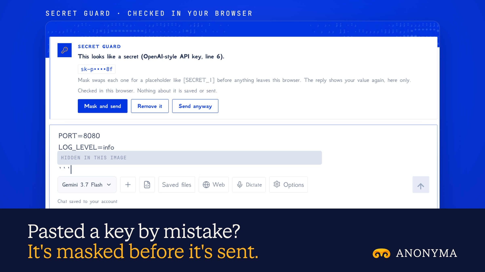

# Secret Guard is live

**Hosted feature release · September 2026**

Pasted code with an API key in it?

Secret Guard checks what you're about to send, in your browser, for passwords,
keys and tokens: private keys, cloud and payment keys, GitHub, GitLab and Slack
tokens, AI provider keys, JWTs, database URLs with a password, and `.env`-style
secrets. When it finds one it says what it looks like and where, with the match
partly hidden, and offers three choices:

- **Mask and send** (the default): the secret becomes a placeholder like
  `[SECRET_1]` before it leaves the browser. The reply comes back with the
  placeholder, and your browser puts the real value back on screen. The map is
  kept only in the tab's memory.
- **Remove it** from the text.
- **Send anyway**, for that message only.

It covers the chat composer and attached text files, Canvas, Code & Build,
Routines, Research Watch and Link Reader. Seed Guard still blocks seed phrases
first. Nothing about a match is stored.

Secret Guard runs in the web app. The developer API (`/v1`) and MCP aren't
checked, because those callers are programs. It's on by default and can be
switched off in Account → Security.

## Image validation

A launch image made from the release build now in production, on a local demo
server, with a made-up key (masked in the image).

- With Mask and send, the request to ANONYMA carried `[SECRET_1]` instead of the
  key; no request carried the key. The server stored the placeholder, and the
  value came back only in the browser.
- The key wasn't in the database or in the browser's saved storage.

2400×1350 JPEG.

Docs and original artwork: CC BY-NC 4.0. Code: PolyForm Noncommercial 1.0.0.
See [LICENSE](../../LICENSE) and [NOTICE](../../NOTICE).
