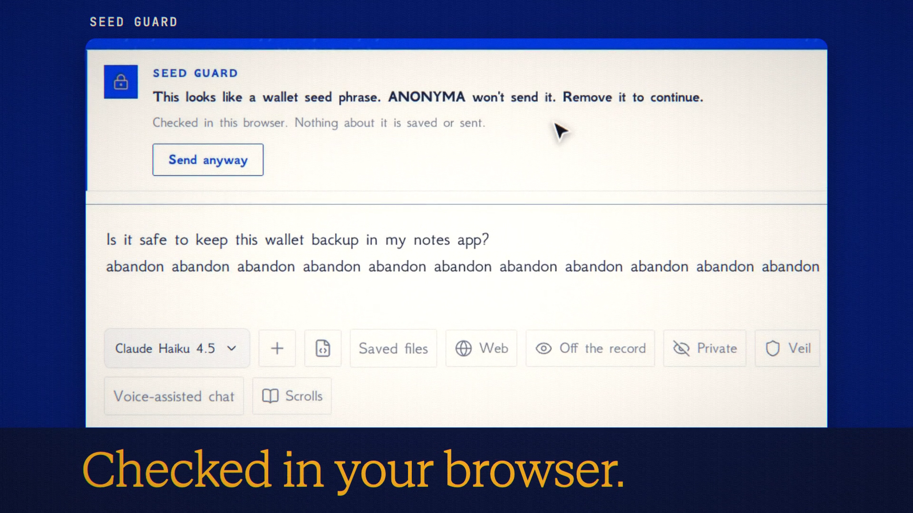

# Seed Guard is live

**Hosted feature release · September 25, 2026**

Your seed phrase never leaves your browser.

Seed Guard is always on. A wallet seed phrase (12–24 BIP39 words with a valid
checksum, plain, numbered or comma-separated), a WIF key or an xprv is stopped
before it is sent: "This looks like a wallet seed phrase. ANONYMA won't send it.
Remove it to continue." It is checked in the browser, and nothing about a match
is logged or stored. A bare 64-character hex string, which could be a private key
or a transaction hash, gets a softer notice with one click on "It's not a key,
send".

It covers the composer, edits, attached documents, standing instructions,
Symposium, Double-check, Task tools, Voice, Scrolls, saved uploads, Memory and
support. On the server, `/api/chat`, `/v1` and MCP refuse a valid seed phrase with
`seed_phrase_blocked`; API clients can opt out with `X-Anonyma-Seed-Guard: off`.

[Download the 18-second launch film](../assets/releases/seed-guard.mp4)

## Notes

"Send anyway" exists for test phrases and asks for a second confirmation.

## Video validation

An 18-second launch film recorded on the released feature with the public BIP39
test phrase ("abandon" eleven times, then "about"; no funds): the block, removing
the phrase and sending; then Bitcoin's genesis coinbase transaction hash getting
the soft notice and a real answer from Claude Haiku 4.5. 1920×1080, 30 fps,
H.264, no audio, metadata removed.

Docs and original artwork: CC BY-NC 4.0. Code: PolyForm Noncommercial 1.0.0.
See [LICENSE](../../LICENSE) and [NOTICE](../../NOTICE).
