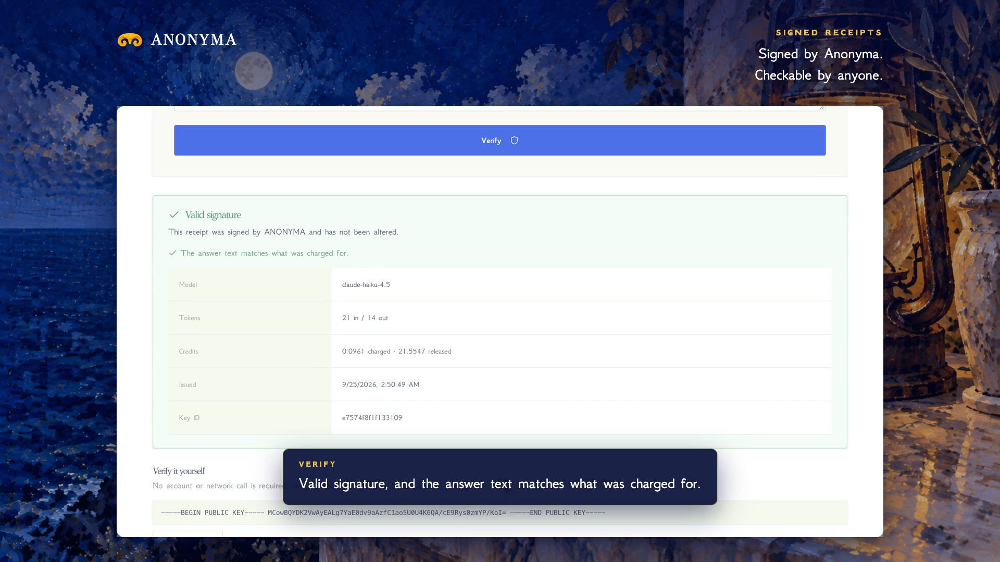

# Signed Receipts are live

**Hosted feature release · September 25, 2026**

Proof of what ran, and what it cost.

Each completed reply now comes with a receipt signed by ANONYMA with an
Ed25519 key: the model, the tokens and the credits charged. A **Signed** badge
sits beside the receipt line, with buttons to copy the signed receipt or verify
it.

The public [verify page](https://askanonyma.com/verify) checks a receipt
against the published public key, without looking anything up in our database.
Paste the answer text too, and it also confirms that this is the answer that
was charged for. Change a single number and the signature fails.

[Download the 41-second launch film](../assets/releases/signed-receipts.mp4)

## Limits

Only completed replies are signed; interrupted or failed requests are not.
Private Mode replies are signed too, and only hashes are stored.

## Video validation

A screen recording of the released feature with a real Claude Haiku 4.5 reply:
Valid signature and a matching answer, then Not valid after changing
credits_charged. 1920×1080, 30 fps, H.264, no audio, metadata removed.

Docs and original artwork: CC BY-NC 4.0. Code: PolyForm Noncommercial 1.0.0.
See [LICENSE](../../LICENSE) and [NOTICE](../../NOTICE).
