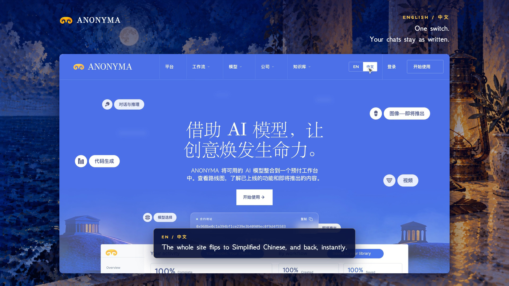

# Simplified Chinese (简体中文) is live

**Hosted feature release · September 25, 2026**

ANONYMA now speaks 中文.

Use the **EN / 中文** switch in the site header, the mobile menu, the footer,
the workspace sidebar or Account → Settings. The homepage, pricing, the
workspace and your account all switch to Simplified Chinese, including the
page title and the page language (`zh-CN`). Switch back and the English is
exactly as before. Your choice is remembered in this browser.

Your chats stay exactly as written: messages you type and the answers models
give are never translated, and neither are brand, model or user names.

[Download the 39-second launch film](../assets/releases/simplified-chinese.mp4)

## Activation

The `zh` entry in `server/releases.js` now has `released: true`. The other
feature releases keep their gates.

## Limitations

The homepage's dashboard preview is a pre-rendered video, so it stays in
English. Model names stay as their providers name them. Features released
after this one need their strings added to `src/i18n/zh.json`.

## Video validation

The launch film is 1920×1080, 30 fps, H.264, without audio. It is a screen
recording of the released site with production's feature set and a real
Claude Haiku 4.5 reply; the typing is shown at double speed. File metadata is
removed.

Docs and original artwork: CC BY-NC 4.0. Code: PolyForm Noncommercial 1.0.0.
See [LICENSE](../../LICENSE) and [NOTICE](../../NOTICE).
