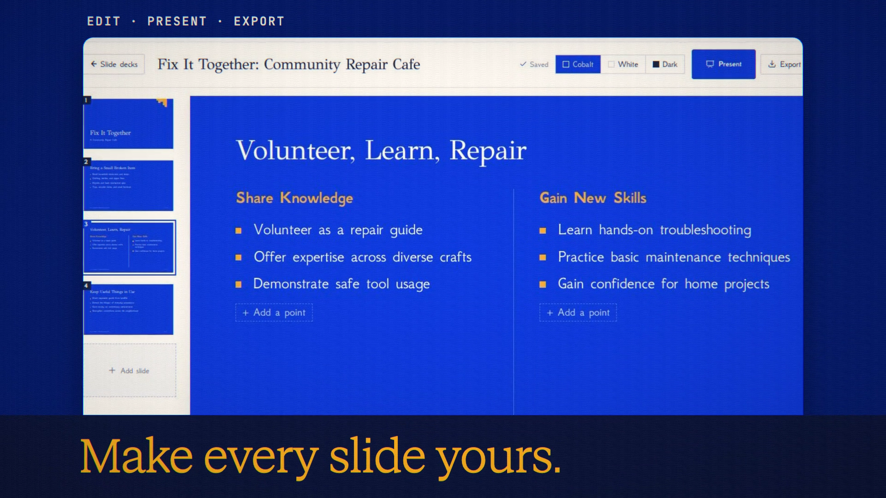

# Slides

**Code release · 27 September 2026 · hosted release live**

Turn a prompt, document or chat into an editable deck.

[Public release commit](https://github.com/Anonyma-RH/Anonyma/commit/07963b4fcad60aeb420bfe542624115025bed37e). The release code is published and deployed at [askanonyma.com](https://askanonyma.com). Production health, exact build revision and all ten feature flags were verified on 2026-09-27T20:16:08.130Z. Deployment used the locally verified application after the owner authorized manual deployment without GitHub Actions. The film remains local demonstration footage.

[Download the 19-second film](../assets/releases/slides.mp4)

## Demonstrated behavior

A real four-slide deck was generated from a fictional repair-cafe brief. The deck and its two-column volunteer slide were inspected.

## Limits

Export to PDF using print or to a self-contained offline HTML file. PPTX is not supported. Check model-generated content. Footage predates the final provider-usage normalization; no displayed cost is used as a pricing promise.

## Media provenance

Edited real UI captures from a local batch 7 app, using synthetic inputs and real provider responses where applicable. Camera moves and titles are authored; the clip is not continuous realtime screen recording. No production customer data or fabricated product output. 1920×1080, 30 fps, H.264 with an original synthesized soundtrack.

Docs and original artwork: CC BY-NC 4.0. Code: PolyForm Noncommercial 1.0.0. See [LICENSE](../../LICENSE) and [NOTICE](../../NOTICE).
