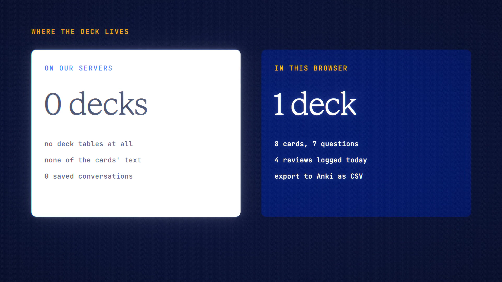

# Study Mode is live

**Hosted feature release · September 2026**

Turn any document or chat into flashcards and a quiz. Your decks stay on your
device.

Paste text, or choose a document or a saved chat, then pick flashcards, a quiz
or both, the number of cards and the difficulty. The model writes cards grounded
in your source; each card carries the snippet it came from. You review with
spaced repetition (Again, Hard, Good, Easy), with due counts and a streak, or
take the quiz for a score.

- Decks and progress are stored in this browser, not encrypted, like a
  downloaded file. ANONYMA's servers never see your decks.
- Export a deck as JSON or as an Anki-compatible CSV, and import decks.
- Generation bills as a normal message, off the record, with the estimate shown
  first.

[Download the 25-second launch film](../assets/releases/study-mode.mp4)

## Video validation

A 25-second launch film recorded on the Study Mode build, on a local demo
account. A pasted paragraph about the water cycle, written for the film, became
8 cards and 7 quiz questions from Gemini 3.7 Flash, for 2.82 credits.

- The deck was saved in the browser's IndexedDB.
- The server had no deck tables, none of the cards' text and no saved
  conversations.
- The generation request carried only the pasted source.

1920×1080, 30 fps, H.264, no audio, metadata removed.

Docs and original artwork: CC BY-NC 4.0. Code: PolyForm Noncommercial 1.0.0.
See [LICENSE](../../LICENSE) and [NOTICE](../../NOTICE).
