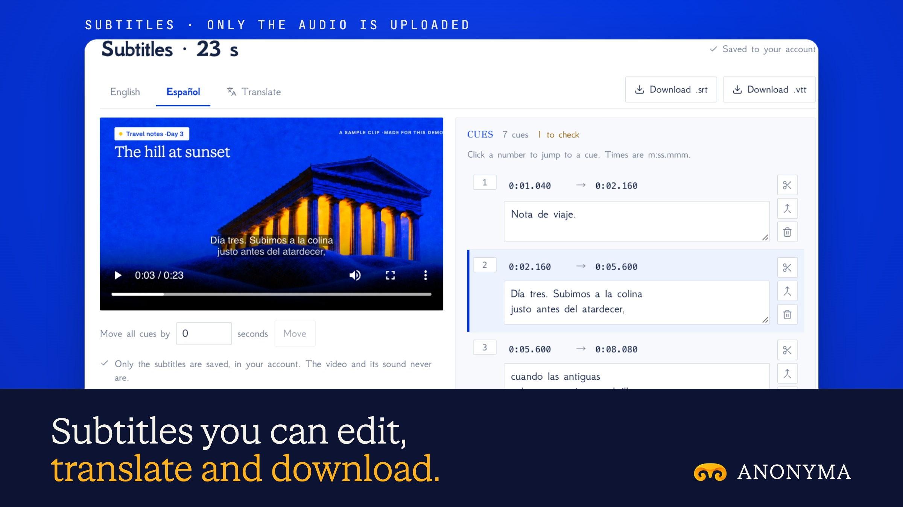

# Subtitles is live

**Hosted feature release · September 2026**

Drop a video. Get subtitles you can edit, translate and download.

Pick a video or audio file. Your browser pulls out the sound as 16 kHz mono
audio, and only that is uploaded for transcription, never the picture.

- You see the price first, and it equals the amount held. Pieces that fail cost
  nothing.
- Cues are built from word timings (up to two short lines each), and play over
  your video locally. Click a cue to jump to it, edit its words or times, and
  merge or split cues.
- Translate the cues into another language, keeping their timings. Translation
  is priced separately and also shows its price first.
- Download `.srt` or `.vtt`. A saved set keeps the cues, not the video.
- Private Mode can translate but can't transcribe, because no speech-to-text
  model offers zero data retention yet.

## Image validation

A launch image made from the release build now in production, on a local demo
server, with a made-up 23-second travel clip.

- The only upload was the sound: 16 kHz mono WAV audio (743 KB), never the
  video (1.4 MB) or its file name.
- Transcription on Deepgram Nova 3 was quoted at up to 2.45 credits and cost
  2.45. The Spanish translation was quoted at up to 15.42 and cost 0.98, keeping
  the timings.
- The saved set holds cues only.

2400×1350 JPEG.

Docs and original artwork: CC BY-NC 4.0. Code: PolyForm Noncommercial 1.0.0.
See [LICENSE](../../LICENSE) and [NOTICE](../../NOTICE).
