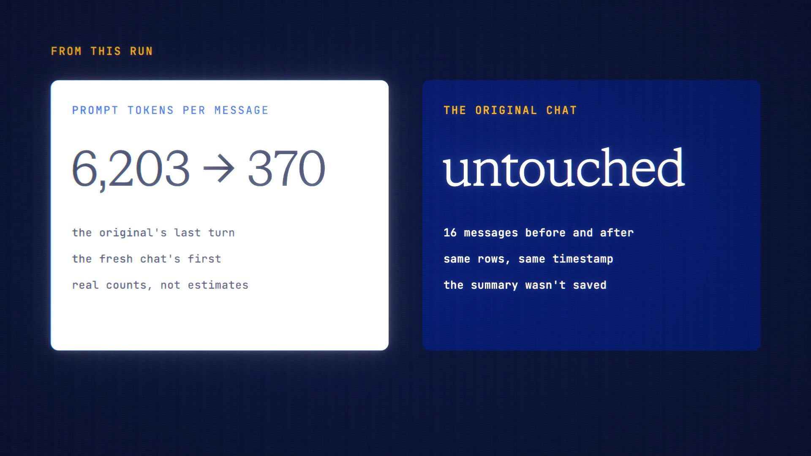

# Summarize & Continue is live

**Hosted feature release · September 2026**

Long chat getting slow and pricey? Get the summary, then continue in a fresh
chat that carries it, and pay for fewer tokens.

In a long chat, **Catch me up** shows the estimate first. It then gives:
- key points;
- decisions made;
- open questions;
- a one-line "where we left off".

The summary is off the record and isn't saved unless you continue.

**Continue fresh** starts a new chat that carries the summary as its context;
you can edit it first. The new chat links back to the original, which stays
exactly as it was. The token savings are shown as an estimate.

- Off-the-record chats continue off the record.
- Projects keep the new chat in the same project.
- In Private Mode, only private models are used.

[Download the 25-second launch film](../assets/releases/summarize-and-continue.mp4)

## Video validation

A 25-second launch film recorded on the Summarize & Continue build, on a local
demo account, using a real 16-message Lisbon-trip chat on Gemini 3.7 Flash.

- **Cost:** the summary charged 3.54 credits, and a follow-up in the fresh chat
  1.22.
- **Tokens:** the dialog estimated 95% fewer. In real prompt tokens, the
  original's last turn used 6,203 and the fresh chat's first turn used 370.
- **Original chat:** unchanged, with the same 16 messages and the same
  timestamp.

1920×1080, 30 fps, H.264, no audio, metadata removed.

Docs and original artwork: CC BY-NC 4.0. Code: PolyForm Noncommercial 1.0.0.
See [LICENSE](../../LICENSE) and [NOTICE](../../NOTICE).
