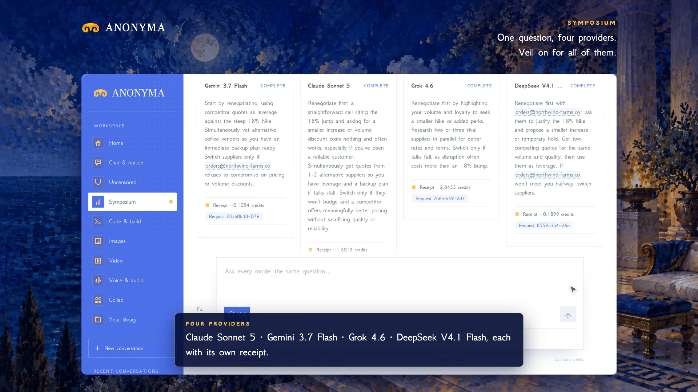

# Symposium is live

**Hosted feature release · September 25, 2026**

Ask several models at once.

Symposium sends one question to up to four models, side by side, each with its
own receipt. When they finish, pick one model to fuse the answers into one and
show where they agreed and where they didn't.

Veil works here too: the question is masked once in your browser and every
model, including the fusing one, receives only the tags.

[Download the 45-second launch film](../assets/releases/symposium.mp4)

## Notes

Symposium runs are saved to your account, even with Private Mode on, with
their own cap of 150 runs; they never push out ordinary chats. Uncensored
models are not offered in Symposium. Each column and the fusion are billed per
token from the prepaid balance.

## Video validation

A screen recording of the released feature with Claude Sonnet 5, Gemini 3.7
Flash, Grok 4.6 and DeepSeek V4.1 Flash, fused by Claude Sonnet 5, with Veil
masking the email in the question for every model. 1920×1080, 30 fps, H.264,
no audio, metadata removed.

Docs and original artwork: CC BY-NC 4.0. Code: PolyForm Noncommercial 1.0.0.
See [LICENSE](../../LICENSE) and [NOTICE](../../NOTICE).
