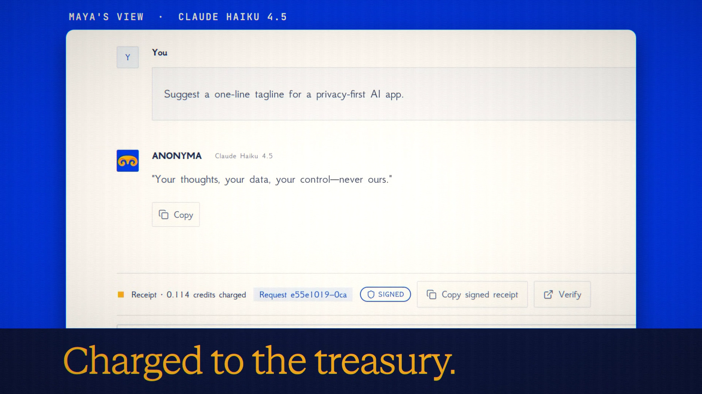

# Team Treasury is live

**Hosted feature release · September 25, 2026**

One team. One shared balance.

A Collab workspace can now hold a treasury. Members contribute credits, the owner
sets each member's daily and monthly limits, and turning on Team pays in a shared
conversation charges the treasury instead of your own balance. Every spend is
listed with who made it.

[Download the 22-second launch film](../assets/releases/team-treasury.mp4)

## Notes

Limits are enforced atomically, so concurrent requests can't overspend. Credits
contributed to a treasury belong to it, the owner controls them, and they can't be
taken back; the contribute dialog says so. An owner can't close their account
while the treasury holds credits, and a contribution is refused while the
contributor's payment is under reconciliation.

## Video validation

A 22-second launch film cut around a real run on the released feature: an owner
contributes 100 credits to the collab "Studio Delta" and sets a member's limits
(50 a day, 100 a month); the member turns on Team pays and gets an answer from
Claude Haiku 4.5 charged to the treasury (0.114 credits, signed receipt); the
owner's Activity shows who spent it. The refusal shot comes from an earlier take
with a 20-credit daily limit. Recorded on the feature branch before release; the
release adds a paused state (shown only if Team Treasury is switched off again)
and a server-side monthly total, and the screens shown are otherwise unchanged.
1920×1080, 30 fps, H.264, no audio, metadata removed.

Docs and original artwork: CC BY-NC 4.0. Code: PolyForm Noncommercial 1.0.0.
See [LICENSE](../../LICENSE) and [NOTICE](../../NOTICE).
