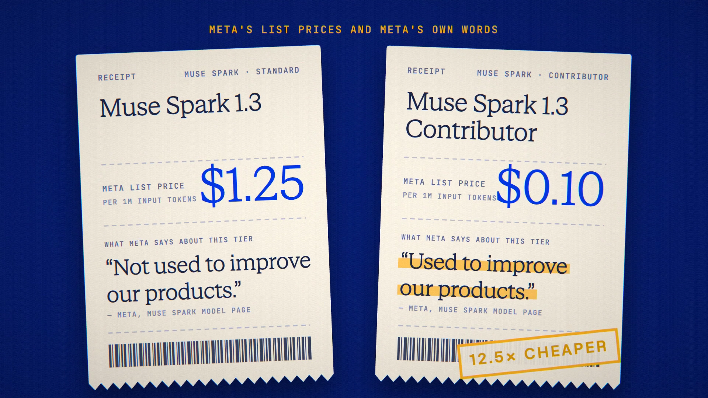

# Training Labels is live

**Hosted feature release · September 25, 2026**

Know which tier you're on.

Some providers sell the same model in two tiers. Meta offers Muse Spark 1.3 as
a standard tier and a cheaper Contributor tier, and says the Contributor tier is
"used to improve our products."

Anonyma now tags models like that "Trains on prompts" wherever you pick one:
the chat model menu, @mentions, Symposium's model list and the Models page. Pick
one and a note under the composer quotes the provider, with one tap to the
standard tier. The note never blocks sending.

Developers get the same flag on `GET /v1/models`: `trains_on_prompts` and
`untrained_alternative`.

[Download the 20-second launch film](../assets/releases/training-labels.mp4)

## Notes

The label reports the provider's own published statement; it is not an audit
by Anonyma. Today it applies to Meta's Muse Spark 1.2 and 1.3 Contributor tiers.
Tagged models aren't listed in Private Mode. Dismissing the note is remembered
per model, in that browser only.

## Video validation

A 20-second launch film cut around a screen recording of the released feature:
searching "muse spark" on the Models page, opening Muse Spark 1.3 Contributor,
the note, one tap to Muse Spark 1.3, the @mention menu and Symposium's model
list. No prompts were sent. 1920×1080, 30 fps, H.264, no audio, metadata
removed.

Docs and original artwork: CC BY-NC 4.0. Code: PolyForm Noncommercial 1.0.0.
See [LICENSE](../../LICENSE) and [NOTICE](../../NOTICE).
