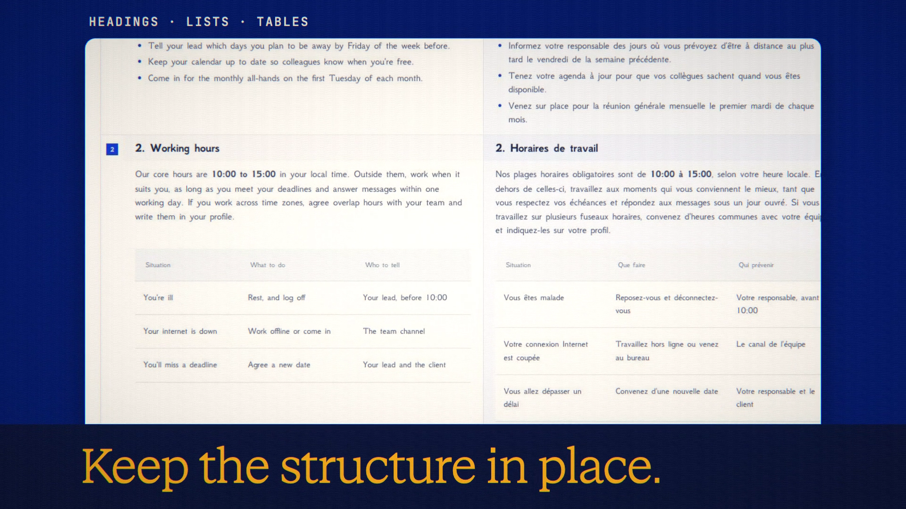

# Translate Documents

**Code release · 27 September 2026 · hosted release live**

Translate documents while retaining headings, lists and tables.

[Public release commit](https://github.com/Anonyma-RH/Anonyma/commit/2a833bd2e88e9c1b7955ba607ee859425bf4a7cb). The release code is published and deployed at [askanonyma.com](https://askanonyma.com). Production health, exact build revision and all ten feature flags were verified on 2026-09-27T20:16:08.130Z. Deployment used the locally verified application after the owner authorized manual deployment without GitHub Actions. The film remains local demonstration footage.

[Download the 19-second film](../assets/releases/translate-documents.mp4)

## Demonstrated behavior

The built-in synthetic five-part remote-work policy was translated into French by Gemini 3.7 Flash. Both versions, headings and the table were inspected side by side.

## Limits

The file stays in the browser; its text is sent in parts, off the record. A glossary is optional. Exports include DOCX, Markdown and PDF. Check machine translations before relying on them.

## Media provenance

Edited real UI captures from a local batch 7 app, using synthetic inputs and real provider responses where applicable. Camera moves and titles are authored; the clip is not continuous realtime screen recording. No production customer data or fabricated product output. 1920×1080, 30 fps, H.264 with an original synthesized soundtrack.

Docs and original artwork: CC BY-NC 4.0. Code: PolyForm Noncommercial 1.0.0. See [LICENSE](../../LICENSE) and [NOTICE](../../NOTICE).
