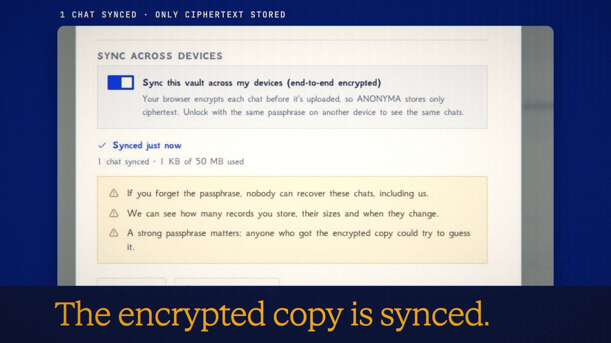

# Vault Sync

**Code release · 27 September 2026 · hosted deployment pending CI**

Sync the encrypted contents of Device Vault between devices.

[Public release commit](https://github.com/Anonyma-RH/Anonyma/commit/fef3fcbfd584d0d71411baa6e6142b458c94e5cf). The release code is published. The hosted rollout is pending GitHub Actions billing recovery; do not treat the local footage as proof that the hosted feature is live.

[Download the 19-second film](../assets/releases/vault-sync.mp4)

## Demonstrated behavior

Sync was enabled for a disposable local vault. A real device-only chat was encrypted and the UI reported one chat synced. This film does not demonstrate a second device or conflict recovery.

## Limits

The passphrase stays on the device. The server can see record counts, sizes and change times. A lost passphrase cannot be recovered. Simultaneous edits produce a conflict copy; a hostile server could withhold updates but cannot read or forge encrypted content.

## Media provenance

Edited real UI captures from a local batch 7 app, using synthetic inputs and real provider responses where applicable. Camera moves and titles are authored; the clip is not continuous realtime screen recording. No production customer data or fabricated product output. 1920×1080, 30 fps, H.264 with an original synthesized soundtrack.

Docs and original artwork: CC BY-NC 4.0. Code: PolyForm Noncommercial 1.0.0. See [LICENSE](../../LICENSE) and [NOTICE](../../NOTICE).
