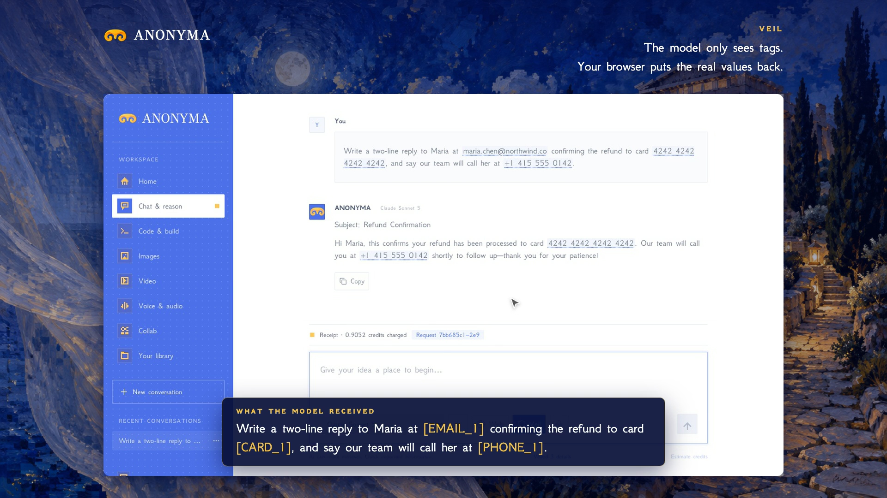

# Veil is live

**Hosted feature release · September 24, 2026**

Private details stay in your browser.

[Open Anonyma chat](https://askanonyma.com/workspace/chat), switch on **Veil** in
the composer and send a prompt. Before it leaves your browser, Veil swaps email
addresses, card numbers, phone numbers, IBANs, wallet addresses and API keys for
numbered tags such as `[EMAIL_1]`. The server and the model receive only the
tags. The answer comes back with them, and your browser puts the real values
back on screen.

A note under the reply says how many details were veiled and shows what the
model saw instead. You can also add words to always veil, such as a name, a
company or a project.

[Download the 30-second launch film](../assets/releases/veil.mp4)

## Activation

The Veil entry in `server/releases.js` now has `released: true`. That commit
enables Veil alongside Code & Build and Live Web Search when
`RELEASED_FEATURES=mvp`. The other feature releases keep their gates. Veil runs
entirely in the browser (`src/veil.js` and `src/Veil.jsx`) and needs no server
change.

## Limitations

Veil catches common patterns, not everything. Card numbers must pass the Luhn
checksum and IBANs the mod-97 check, so unusual formats can pass through
unveiled. Names, addresses and other free text are veiled only when you add
them to the always-veil list. The map from tags back to real values is kept in
this browser's local storage and never sent anywhere, so another device, or
this one after its site data is cleared, shows the tags instead.

## Run locally

Follow the [local setup](../../README.md#run-locally) and set
`RELEASED_FEATURES=mvp`. The detection and restore logic is covered by
`tests/veil.test.mjs`.

## Video validation

The launch film is 1920×1080, 30 fps, H.264, without audio. It is a screen
recording of the feature returning real model output, with file metadata
removed.

Docs and original artwork: CC BY-NC 4.0. Code: PolyForm Noncommercial 1.0.0.
See [LICENSE](../../LICENSE) and [NOTICE](../../NOTICE).
