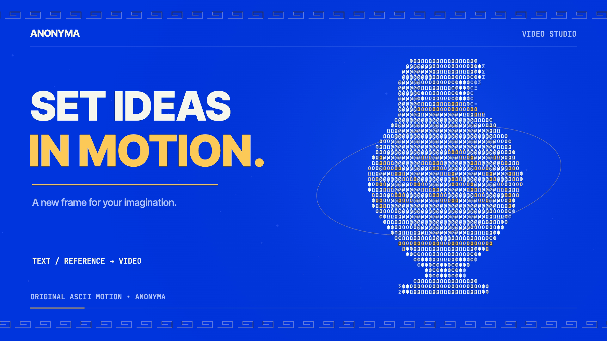

# Video Studio

**Hosted feature release · September 25, 2026**

Turn ideas into motion in [Anonyma Video Studio](https://askanonyma.com/workspace/video). Start with a text prompt or a supported reference image, choose your model's duration and frame options, and find completed videos in your library. Generation uses prepaid credits.

[Download the Greek ASCII launch film](../assets/releases/video-studio.mp4)

## What ships

Video Studio exposes available video models and their published presets, submits generation jobs and saves completed media in your library. Reference-image support, duration, ratio and quality depend on the selected model. Generation times vary. Other upcoming features retain their independent release gates.

A timeout or server error during submission can leave the outcome uncertain. Such a job retains its credit reservation for reconciliation and is not automatically submitted again. Definite provider refusals release the reservation.

## Film and limitations

The 20.17-second film uses original animated Greek ASCII amphora artwork on Anonyma blue. The prompt, controls and storyboard are labeled illustrations; they are not recordings of generated provider output. The 1920×1080, 30 fps H.264/AAC export passed full decode, audio headroom, text-recognition and visual checks on SHA-256 e7dced011b02c655031b74d7d39673a3d625907c5e35249f595e8fe9a71fef10.

Provider availability and prices may change. This release does not promise instant or unlimited generation, or identical capabilities across models.

## X draft

Turn ideas into motion.

ANONYMA Video Studio is live.

Start with a prompt or a supported reference image, choose your model's duration and frame options, and find completed videos in your library.

https://askanonyma.com

Docs and original artwork: CC BY-NC 4.0. Code: PolyForm Noncommercial 1.0.0. See [LICENSE](../../LICENSE) and [NOTICE](../../NOTICE).
