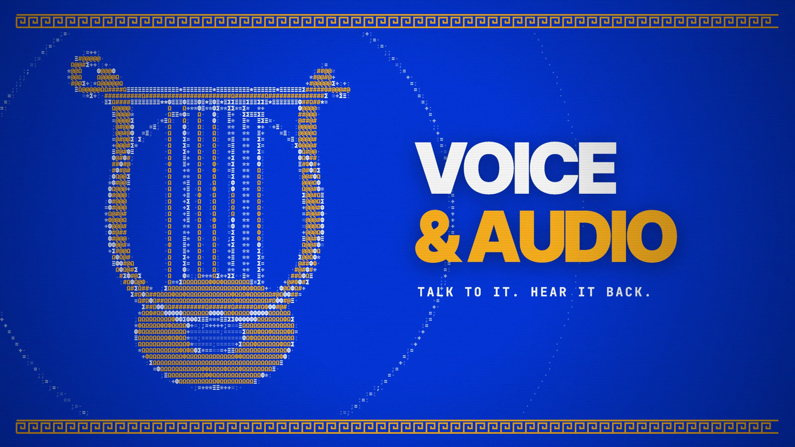

# Voice & Audio

**Hosted feature release · September 25, 2026**

Turn text into speech saved in your library, and dictate prompts into the chat composer using the microphone.

[Open Voice & Audio](https://askanonyma.com/workspace/audio)

[Download the launch film](../assets/releases/voice-and-audio.mp4)

## What ships and limitations

Speech models, voices and transcription support depend on the configured provider. Microphone dictation requires browser permission. Generation and transcription use prepaid credits. The workspace does not promise an arbitrary recording upload interface.

## Film

The film uses original animated Greek ASCII lyre and microphone artwork. Controls, waveforms and example values are labeled illustrations.

The 20.13-second 1920×1080, 30 fps H.264/AAC export passed full decode, audio headroom, text-recognition and visual checks on SHA-256 72d0c94c00a15233a587deca8729e27c75a18d7ce0918a357f50c06b51d470b0.

## X draft

Give your words a voice.

ANONYMA Voice & Audio is live.

Turn scripts into speech saved to your library. Dictate prompts straight into your composer. Use your prepaid credits.

https://askanonyma.com

Docs and original artwork: CC BY-NC 4.0. Code: PolyForm Noncommercial 1.0.0. See [LICENSE](../../LICENSE) and [NOTICE](../../NOTICE).
